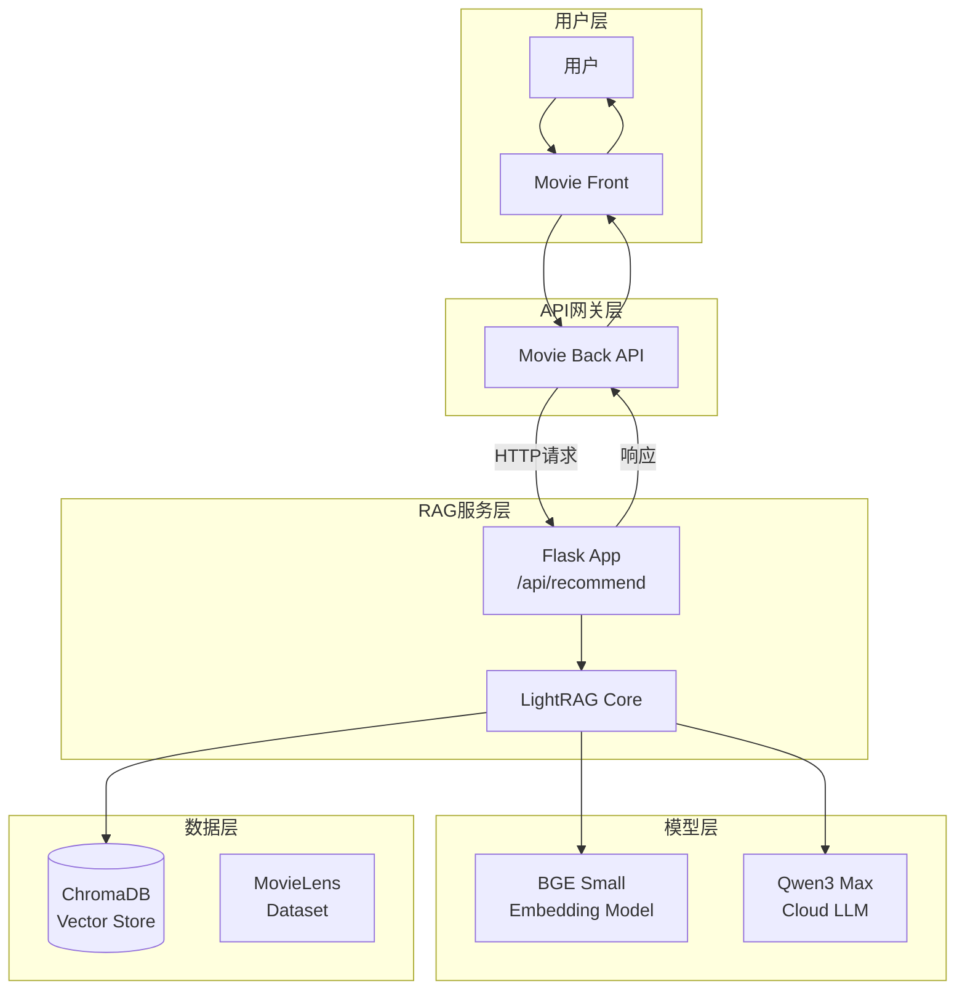
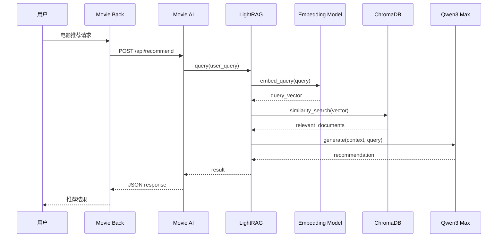
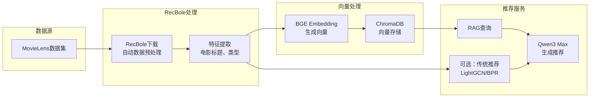

# AI电影推荐助手 RAG开发计划

## 1. 项目概述

### 1.1 项目目标
基于LightRAG框架开发一个AI电影推荐系统，通过MovieLens数据集和Flask后端，为用户提供智能的电影推荐服务。

### 1.2 核心需求
- 使用LightRAG实现快速开发
- 轻量级embedding模型（BAAI/bge-small-zh）
- 云端大模型使用通义千问3 Max（Qwen3_max）
- 复用movie_back中的ChromaDB
- 使用MovieLens最小数据集（100K）
- 通过HTTP接口供movie_back调用

---

## 2. 技术选型

### 2.1 RAG框架对比

| 框架 | 优势 | 劣势 | 选择 |
|------|------|------|------|
| **LangChain** | 功能强大、生态完善、文档丰富 | 学习曲线陡峭、配置复杂、代码量大 | ❌ |
| **LightRAG** | 轻量级、快速集成、代码简洁、适合快速开发 | 功能相对有限、生态较小 | ✅ |

**选择理由**：LightRAG更适合快速开发，代码量少，易于维护，满足项目需求。

### 2.2 Embedding模型对比

| 模型 | 维度 | 大小 | 性能 | 选择 |
|------|------|------|------|------|
| BAAI/bge-large-zh | 1024 | ~1.3GB | 高 | ❌ |
| **BAAI/bge-small-zh** | **512** | **~200MB** | 中等 | ✅ |
| text2vec-base-chinese | 768 | ~400MB | 中等 | ❌ |

### 2.4 RecBole框架介绍

**RecBole** 是一个基于 PyTorch 的推荐系统框架，具有以下特点：

| 特性 | 说明 |
|------|------|
| **50+ 推荐算法** | LightGCN、BPR、NCF、FM、DeepFM 等经典算法 |
| **自动数据加载** | 内置支持 MovieLens 100K/1M/25M 等标准数据集 |
| **数据处理** | 自动数据预处理、特征工程、数据划分 |
| **训练评估** | 一键训练和评估，支持多种指标（Recall、NDCG、MRR等） |
| **易于使用** | 简洁的API，适合快速开发和毕业设计 |

**选择理由**：
- 自动下载和处理MovieLens数据，节省开发时间
- 可选集成推荐算法，增强系统功能
- 标准化的数据处理流程，代码质量高
- 适合学术研究和毕业设计项目

### 2.3 技术栈

```yaml
后端框架: Flask 3.0
RAG框架: LightRAG
数据处理: RecBole (推荐系统框架)
Embedding: BAAI/bge-small-zh (Sentence-Transformers)
LLM: 通义千问3 Max (Qwen3_max)
向量数据库: ChromaDB (复用movie_back)
数据集: MovieLens 100K (通过RecBole下载)
推荐算法: LightGCN, BPR, NCF (可选)
数据库客户端: chromadb==0.4.22
```

---

## 3. 系统架构

### 3.1 整体架构图



### 3.2 RAG处理流程图



### 3.3 系统数据流程图



### 3.4 目录结构

```
movie_ai/
├── README.md                    # 项目说明
├── rag开发计划.md               # 本文档
├── requirements.txt             # Python依赖
├── configs/                     # 配置文件目录
│   └── recbole_config.yaml     # RecBole配置
├── data/                        # 数据目录
│   └── ml-100k/                # RecBole自动下载的MovieLens数据
│       ├── ml-100k.inter
│       ├── ml-100k.item
│       └── ml-100k.user
├── src/                        # 源代码
│   ├── __init__.py
│   ├── app.py                  # Flask应用主入口
│   ├── config.py               # 配置管理
│   ├── embedding.py            # Embedding模型封装
│   ├── llm.py                  # LLM调用封装
│   ├── rag.py                  # RAG核心逻辑
│   ├── vector_store.py         # 向量数据库操作
│   └── utils.py                # 工具函数
├── scripts/                    # 脚本目录
│   ├── download_data.py        # RecBole下载数据脚本
│   ├── recbole_to_vectorstore.py  # 数据转换脚本
│   └── train_recbole.py        # RecBole训练模型脚本
├── saved/                      # RecBole保存的模型
│   └── LightGCN-ml-100k.pth
└── logs/                        # 日志目录
```

---

## 4. 核心代码实现

### 4.1 配置管理 (src/config.py)

```python
import os
from dotenv import load_dotenv

load_dotenv()

class Config:
    """配置类"""
    
    # Flask配置
    FLASK_APP_NAME = 'Movie AI RAG Service'
    FLASK_HOST = os.getenv('FLASK_HOST', '0.0.0.0')
    FLASK_PORT = int(os.getenv('FLASK_PORT', 5001))
    FLASK_DEBUG = os.getenv('FLASK_DEBUG', 'False').lower() == 'true'
    
    # Embedding模型配置
    EMBEDDING_MODEL_NAME = 'BAAI/bge-small-zh'
    EMBEDDING_DEVICE = 'cpu'  # 'cuda' 或 'cpu'
    EMBEDDING_DIMENSION = 512
    
    # LLM配置 (Qwen3 Max)
    QWEN_API_KEY = os.getenv('QWEN_API_KEY', '')
    QWEN_API_URL = os.getenv('QWEN_API_URL', 
        'https://dashscope.aliyuncs.com/compatible-mode/v1')
    QWEN_MODEL = 'qwen-max-latest'
    QWEN_TEMPERATURE = 0.7
    QWEN_MAX_TOKENS = 1000
    
    # ChromaDB配置 (复用movie_back)
    CHROMA_HOST = os.getenv('CHROMA_HOST', 'localhost')
    CHROMA_PORT = int(os.getenv('CHROMA_PORT', 8000))
    CHROMA_COLLECTION_NAME = 'movies'
    
    # RAG配置
    TOP_K = 5  # 检索Top-K相关文档
    CHUNK_SIZE = 200  # 文本分块大小
    CHUNK_OVERLAP = 50  # 分块重叠
    
    # 数据路径
    DATA_DIR = os.path.join(os.path.dirname(__file__), '..', 'data')
    LOG_DIR = os.path.join(os.path.dirname(__file__), '..', 'logs')
    
    @classmethod
    def validate(cls):
        """验证配置"""
        if not cls.QWEN_API_KEY:
            raise ValueError("QWEN_API_KEY not set in environment variables")
```

### 4.2 Embedding模型封装 (src/embedding.py)

```python
from sentence_transformers import SentenceTransformer
from typing import List, Union
import numpy as np
from src.config import Config

class EmbeddingModel:
    """Embedding模型封装"""
    
    def __init__(self):
        """初始化embedding模型"""
        print(f"Loading embedding model: {Config.EMBEDDING_MODEL_NAME}")
        self.model = SentenceTransformer(
            Config.EMBEDDING_MODEL_NAME,
            device=Config.EMBEDDING_DEVICE
        )
        print("Embedding model loaded successfully")
    
    def embed_text(self, text: str) -> List[float]:
        """对单条文本进行embedding"""
        embedding = self.model.encode(
            text,
            convert_to_numpy=True,
            normalize_embeddings=True
        )
        return embedding.tolist()
    
    def embed_batch(self, texts: List[str]) -> List[List[float]]:
        """批量embedding"""
        embeddings = self.model.encode(
            texts,
            batch_size=32,
            convert_to_numpy=True,
            normalize_embeddings=True,
            show_progress_bar=True
        )
        return embeddings.tolist()
    
    def embed_documents(self, documents: List[str]) -> np.ndarray:
        """对文档列表进行embedding"""
        return self.model.encode(
            documents,
            batch_size=32,
            show_progress_bar=True
        )
```

### 4.3 LLM调用封装 (src/llm.py)

```python
import openai
from typing import Dict, List, Optional
from src.config import Config

class QwenLLM:
    """通义千问3 Max LLM封装"""
    
    def __init__(self):
        """初始化LLM客户端"""
        self.client = openai.OpenAI(
            api_key=Config.QWEN_API_KEY,
            base_url=Config.QWEN_API_URL
        )
        self.model = Config.QWEN_MODEL
    
    def generate(
        self, 
        query: str, 
        context: str,
        temperature: Optional[float] = None,
        max_tokens: Optional[int] = None
    ) -> str:
        """
        根据上下文生成回答
        
        Args:
            query: 用户查询
            context: 检索到的相关上下文
            temperature: 温度参数
            max_tokens: 最大token数
            
        Returns:
            生成的回答文本
        """
        system_prompt = """你是一个专业的电影推荐助手。根据用户的需求和提供的电影信息，
给出个性化的电影推荐建议。推荐要基于电影的类型、评分、简介等特征。
回答要友好、专业，并简要说明推荐理由。"""
        
        user_message = f"""用户需求: {query}

相关电影信息:
{context}

请根据以上信息，为用户推荐电影并说明理由。"""
        
        response = self.client.chat.completions.create(
            model=self.model,
            messages=[
                {"role": "system", "content": system_prompt},
                {"role": "user", "content": user_message}
            ],
            temperature=temperature or Config.QWEN_TEMPERATURE,
            max_tokens=max_tokens or Config.QWEN_MAX_TOKENS
        )
        
        return response.choices[0].message.content
    
    def chat(self, messages: List[Dict]) -> str:
        """多轮对话"""
        response = self.client.chat.completions.create(
            model=self.model,
            messages=messages,
            temperature=Config.QWEN_TEMPERATURE,
            max_tokens=Config.QWEN_MAX_TOKENS
        )
        return response.choices[0].message.content
```

### 4.4 向量数据库操作 (src/vector_store.py)

```python
import chromadb
from chromadb.config import Settings
from typing import List, Dict, Optional
from src.config import Config

class VectorStore:
    """ChromaDB向量数据库操作封装"""
    
    def __init__(self):
        """初始化ChromaDB客户端"""
        self.client = chromadb.HttpClient(
            host=Config.CHROMA_HOST,
            port=Config.CHROMA_PORT,
            settings=Settings(allow_reset=True)
        )
        self.collection = self._get_or_create_collection()
    
    def _get_or_create_collection(self):
        """获取或创建collection"""
        try:
            collection = self.client.get_collection(name=Config.CHROMA_COLLECTION_NAME)
            print(f"Found existing collection: {Config.CHROMA_COLLECTION_NAME}")
            return collection
        except Exception:
            print(f"Creating new collection: {Config.CHROMA_COLLECTION_NAME}")
            return self.client.create_collection(
                name=Config.CHROMA_COLLECTION_NAME,
                metadata={"hnsw:space": "cosine"}
            )
    
    def add_documents(
        self,
        ids: List[str],
        embeddings: List[List[float]],
        documents: List[str],
        metadatas: Optional[List[Dict]] = None
    ):
        """添加文档到向量库"""
        self.collection.add(
            ids=ids,
            embeddings=embeddings,
            documents=documents,
            metadatas=metadatas
        )
        print(f"Added {len(ids)} documents to collection")
    
    def search(
        self,
        query_embedding: List[float],
        top_k: int = None
    ) -> Dict:
        """
        相似度搜索
        
        Returns:
            {
                'ids': [...],
                'documents': [...],
                'metadatas': [...],
                'distances': [...]
            }
        """
        top_k = top_k or Config.TOP_K
        results = self.collection.query(
            query_embeddings=[query_embedding],
            n_results=top_k
        )
        return results
    
    def get_collection_info(self) -> Dict:
        """获取collection信息"""
        count = self.collection.count()
        return {
            'name': Config.CHROMA_COLLECTION_NAME,
            'count': count,
            'dimension': Config.EMBEDDING_DIMENSION
        }
```

### 4.5 RAG核心逻辑 (src/rag.py)

```python
from typing import List, Dict, Optional
from src.config import Config
from src.embedding import EmbeddingModel
from src.llm import QwenLLM
from src.vector_store import VectorStore

class RAGSystem:
    """RAG系统核心类"""
    
    def __init__(self):
        """初始化RAG系统"""
        self.embedding_model = EmbeddingModel()
        self.llm = QwenLLM()
        self.vector_store = VectorStore()
    
    def query(self, user_query: str, top_k: Optional[int] = None) -> Dict:
        """
        执行RAG查询
        
        Args:
            user_query: 用户查询文本
            top_k: 检索的文档数量
            
        Returns:
            {
                'query': str,
                'recommendations': str,  # LLM生成的推荐
                'context': List[Dict],  # 检索到的相关文档
                'raw_response': {...}   # 原始检索结果
            }
        """
        # 1. 将用户查询转换为向量
        query_embedding = self.embedding_model.embed_text(user_query)
        
        # 2. 向量检索
        search_results = self.vector_store.search(query_embedding, top_k)
        
        # 3. 构建上下文
        context = self._build_context(search_results)
        
        # 4. LLM生成推荐
        recommendation = self.llm.generate(
            query=user_query,
            context=context
        )
        
        # 5. 返回结果
        return {
            'query': user_query,
            'recommendations': recommendation,
            'context': self._format_context(search_results),
            'raw_response': search_results
        }
    
    def _build_context(self, search_results: Dict) -> str:
        """构建LLM的上下文文本"""
        documents = search_results.get('documents', [[]])[0]
        metadatas = search_results.get('metadatas', [[]])[0]
        
        context_parts = []
        for i, (doc, meta) in enumerate(zip(documents, metadatas), 1):
            context_parts.append(f"电影{i}:")
            if meta:
                title = meta.get('title', '未知')
                genres = meta.get('genres', '')
                rating = meta.get('rating', 'N/A')
                context_parts.append(f"  片名: {title}")
                context_parts.append(f"  类型: {genres}")
                context_parts.append(f"  评分: {rating}")
            context_parts.append(f"  简介: {doc}")
            context_parts.append("")
        
        return "\n".join(context_parts)
    
    def _format_context(self, search_results: Dict) -> List[Dict]:
        """格式化上下文用于返回"""
        documents = search_results.get('documents', [[]])[0]
        metadatas = search_results.get('metadatas', [[]])[0]
        distances = search_results.get('distances', [[]])[0]
        
        formatted = []
        for doc, meta, dist in zip(documents, metadatas, distances):
            formatted.append({
                'document': doc,
                'metadata': meta,
                'similarity': 1 - dist  # 转换为相似度
            })
        
        return formatted
    
    def health_check(self) -> Dict:
        """系统健康检查"""
        try:
            collection_info = self.vector_store.get_collection_info()
            return {
                'status': 'healthy',
                'collection': collection_info,
                'embedding_model': Config.EMBEDDING_MODEL_NAME,
                'llm_model': Config.QWEN_MODEL
            }
        except Exception as e:
            return {
                'status': 'unhealthy',
                'error': str(e)
            }
```

### 4.6 Flask应用 (src/app.py)

```python
from flask import Flask, request, jsonify
from flask_cors import CORS
import logging
import os
from src.config import Config
from src.rag import RAGSystem
from src.utils import setup_logging

# 初始化Flask应用
app = Flask(__name__)
CORS(app)  # 允许跨域请求

# 配置日志
setup_logging(Config.LOG_DIR)

# 初始化RAG系统
rag_system = RAGSystem()

@app.route('/health', methods=['GET'])
def health_check():
    """健康检查接口"""
    result = rag_system.health_check()
    return jsonify(result), 200 if result['status'] == 'healthy' else 500

@app.route('/api/recommend', methods=['POST'])
def recommend():
    """
    电影推荐接口
    
    Request Body:
    {
        "query": "推荐一部科幻电影"
    }
    
    Response:
    {
        "query": "...",
        "recommendations": "...",
        "context": [...],
        "success": true
    }
    """
    try:
        data = request.get_json()
        
        if not data or 'query' not in data:
            return jsonify({
                'success': False,
                'error': 'Missing query parameter'
            }), 400
        
        user_query = data['query']
        
        # 执行RAG查询
        result = rag_system.query(user_query)
        
        return jsonify({
            'success': True,
            **result
        }), 200
        
    except Exception as e:
        logging.error(f"Error in recommend endpoint: {str(e)}", exc_info=True)
        return jsonify({
            'success': False,
            'error': str(e)
        }), 500

@app.route('/api/health', methods=['GET'])
def api_health():
    """API健康检查（用于movie_back调用）"""
    return jsonify({
        'service': 'Movie AI RAG Service',
        'status': 'running',
        'version': '1.0.0'
    }), 200

@app.errorhandler(404)
def not_found(error):
    return jsonify({'success': False, 'error': 'Endpoint not found'}), 404

@app.errorhandler(500)
def internal_error(error):
    return jsonify({'success': False, 'error': 'Internal server error'}), 500

def main():
    """启动应用"""
    print(f"Starting {Config.FLASK_APP_NAME}")
    print(f"Embedding Model: {Config.EMBEDDING_MODEL_NAME}")
    print(f"LLM Model: {Config.QWEN_MODEL}")
    print(f"ChromaDB: {Config.CHROMA_HOST}:{Config.CHROMA_PORT}")
    
    app.run(
        host=Config.FLASK_HOST,
        port=Config.FLASK_PORT,
        debug=Config.FLASK_DEBUG
    )

if __name__ == '__main__':
    main()
```

### 4.7 工具函数 (src/utils.py)

```python
import logging
import os

def setup_logging(log_dir: str):
    """配置日志"""
    os.makedirs(log_dir, exist_ok=True)
    
    log_file = os.path.join(log_dir, 'rag_service.log')
    
    logging.basicConfig(
        level=logging.INFO,
        format='%(asctime)s - %(name)s - %(levelname)s - %(message)s',
        handlers=[
            logging.FileHandler(log_file),
            logging.StreamHandler()
        ]
    )

def truncate_text(text: str, max_length: int = 200) -> str:
    """截断文本"""
    if len(text) <= max_length:
        return text
    return text[:max_length] + '...'
```

### 4.8 依赖配置 (requirements.txt)

```
Flask==3.0.0
flask-cors==4.0.0
sentence-transformers==2.2.2
chromadb==0.4.22
openai==1.12.0
python-dotenv==1.0.0
numpy==1.24.3
pandas==2.0.3
recbole==0.2.1
torch==2.0.1
scipy==1.11.1
```

---

## 5. 数据处理流程

### 5.1 使用RecBole下载和处理数据

RecBole内置了MovieLens数据集，可以自动下载和预处理。

```bash
# RecBole会自动下载数据集到 ~/.recbole/dataset/
# 首次运行时会自动下载，后续直接使用缓存
```

### 5.2 RecBole配置文件 (configs/recbole_config.yaml)

```yaml
# RecBole配置文件
dataset: ml-100k
field_separator: "\t"
seq_separator: " "

# 数据字段配置
user_inter_num: 3
item_inter_num: 3

# 评分阈值
threshold:
    rating: 4.0

# 数据加载
load_col:
    inter: [user_id, item_id, rating, timestamp]
    item: [item_id, title, genres]

# 数据过滤
filter_out_cod_start_users: True
filter_out_cod_start_items: True

# 评估指标
eval_args:
    split: {'RS': [0.8, 0.1, 0.1]}
    order: 'RO'
    mode: 'full'

# 评估指标
metrics: ['Recall', 'NDCG', 'MRR', 'Hit', 'Precision']
topk: [5, 10, 20]

# 设备
device: cuda:0
```

### 5.3 数据下载和预处理脚本 (scripts/download_data.py)

```python
"""
使用RecBole下载和预处理MovieLens数据
"""
from recbole.config import Config
from recbole.data import create_dataset, data_preparation
import os

def download_and_preprocess_movielens(dataset='ml-100k'):
    """
    使用RecBole下载和预处理MovieLens数据
    
    Args:
        dataset: 数据集名称 (ml-100k, ml-1m, ml-25m)
    """
    print(f"=== 开始下载和预处理 {dataset} 数据集 ===")
    
    # RecBole配置
    config_dict = {
        'dataset': dataset,
        'data_path': os.path.join(os.path.dirname(__file__), '..', 'data'),
        'device': 'cpu'
    }
    
    # 创建配置对象
    config = Config(config_dict=config_dict)
    
    # 自动下载并加载数据集
    print("下载数据集中...")
    dataset_obj = create_dataset(config)
    print(f"数据集加载成功！")
    
    # 数据预处理
    print("预处理数据...")
    train_data, valid_data, test_data = data_preparation(config, dataset_obj)
    
    # 打印数据集信息
    print("\n=== 数据集信息 ===")
    print(f"用户数: {dataset_obj.user_num}")
    print(f"物品数: {dataset_obj.item_num}")
    print(f"训练集交互数: {len(train_data.dataset)}")
    print(f"验证集交互数: {len(valid_data.dataset)}")
    print(f"测试集交互数: {len(test_data.dataset)}")
    
    # 保存处理后的数据
    print("\n保存处理后的数据...")
    config.save_config(os.path.join(os.path.dirname(__file__), '..', 'data'))
    
    print(f"\n✓ 数据下载和预处理完成！")
    print(f"数据存储在: {config['data_path']}")
    
    return dataset_obj, train_data, valid_data, test_data

def get_dataset_statistics(dataset='ml-100k'):
    """获取数据集统计信息"""
    from recbole.config import Config
    from recbole.data import create_dataset
    
    config = Config(config_dict={'dataset': dataset})
    dataset_obj = create_dataset(config)
    
    print(f"\n=== {dataset} 数据集统计 ===")
    print(f"用户数: {dataset_obj.user_num:,}")
    print(f"物品数: {dataset_obj.item_num:,}")
    print(f"交互数: {dataset_obj.inter_num:,}")
    
    return dataset_obj

if __name__ == '__main__':
    # 下载和预处理数据
    download_and_preprocess_movielens('ml-100k')
    
    # 查看统计信息
    get_dataset_statistics('ml-100k')
```

### 5.4 从RecBole数据转换为向量库 (scripts/recbole_to_vectorstore.py)

```python
"""
将RecBole处理后的MovieLens数据转换为向量库
"""
import pandas as pd
import os
from recbole.config import Config
from recbole.data import create_dataset
from src.config import Config
from src.embedding import EmbeddingModel
from src.vector_store import VectorStore

def convert_recbole_to_vectorstore(dataset='ml-100k'):
    """
    将RecBole数据集转换为ChromaDB向量库
    
    Args:
        dataset: 数据集名称
    """
    print(f"=== 将 {dataset} 数据转换为向量库 ===")
    
    # 1. 使用RecBole加载数据
    recbole_config = Config(config_dict={'dataset': dataset})
    dataset_obj = create_dataset(recbole_config)
    
    # 2. 获取电影信息（item字段）
    # RecBole的数据存储在dataset_obj的item_feat中
    item_feat = dataset_obj.item_feat
    
    print(f"总电影数: {len(item_feat)}")
    
    # 3. 准备文档和元数据
    documents = []
    metadatas = []
    ids = []
    
    for idx, item_id in enumerate(item_feat['item_id']):
        title = item_feat['title'][idx]
        genres = item_feat['genres'][idx]
        
        # 构建文档文本
        doc = f"{title} is a {genres} movie."
        documents.append(doc)
        
        # 构建元数据
        metadata = {
            'movie_id': str(item_id),
            'title': str(title),
            'genres': str(genres)
        }
        metadatas.append(metadata)
        ids.append(str(item_id))
    
    print(f"准备导入 {len(documents)} 部电影...")
    
    # 4. 生成embeddings
    print("生成embeddings...")
    embedding_model = EmbeddingModel()
    embeddings = embedding_model.embed_batch(documents)
    
    # 5. 存入向量库
    print("存储到向量数据库...")
    vector_store = VectorStore()
    
    # 清空已有数据（可选）
    # vector_store.client.delete_collection(Config.CHROMA_COLLECTION_NAME)
    # vector_store.collection = vector_store._get_or_create_collection()
    
    vector_store.add_documents(
        ids=ids,
        embeddings=embeddings,
        documents=documents,
        metadatas=metadatas
    )
    
    print(f"\n✓ 成功导入 {len(ids)} 部电影到向量数据库")
    
    # 6. 验证导入
    collection_info = vector_store.get_collection_info()
    print(f"\n=== 向量库信息 ===")
    print(f"Collection名称: {collection_info['name']}")
    print(f"文档数量: {collection_info['count']}")
    print(f"向量维度: {collection_info['dimension']}")

if __name__ == '__main__':
    convert_recbole_to_vectorstore('ml-100k')
```

### 5.5 可选：使用RecBole训练推荐模型 (scripts/train_recbole.py)

```python
"""
使用RecBole训练推荐模型（可选）
"""
from recbole.config import Config
from recbole.data import create_dataset, data_preparation
from recbole.trainer import Trainer
from recbole.model import LightGCN

def train_recommendation_model(model_name='LightGCN', dataset='ml-100k'):
    """
    使用RecBole训练推荐模型
    
    Args:
        model_name: 模型名称 (LightGCN, BPR, NCF等)
        dataset: 数据集名称
    """
    print(f"=== 训练 {model_name} 模型 ===")
    
    # 配置参数
    config_dict = {
        'dataset': dataset,
        'model': model_name,
        'epochs': 10,  # 训练轮数
        'batch_size': 256,
        'learning_rate': 0.001,
        'eval_step': 1,
        'stopping_step': 10,
        'device': 'cpu'  # 使用CPU训练，有GPU可改为 'cuda:0'
    }
    
    # 创建配置
    config = Config(config_dict=config_dict)
    
    # 加载数据
    dataset_obj = create_dataset(config)
    train_data, valid_data, test_data = data_preparation(config, dataset_obj)
    
    # 初始化模型
    model = LightGCN(config, train_data.dataset).to(config['device'])
    print(f"模型参数量: {sum(p.numel() for p in model.parameters()):,}")
    
    # 训练
    print("\n开始训练...")
    trainer = Trainer(config, model)
    best_valid_score, best_valid_result = trainer.fit(train_data, valid_data)
    
    # 测试
    print("\n测试模型...")
    test_result = trainer.evaluate(test_data)
    
    print(f"\n=== 训练完成 ===")
    print(f"最佳验证分数: {best_valid_score:.4f}")
    print(f"测试结果:")
    for metric, value in test_result.items():
        print(f"  {metric}: {value:.4f}")
    
    return trainer, model

if __name__ == '__main__':
    # 训练LightGCN模型
    trainer, model = train_recommendation_model('LightGCN', 'ml-100k')
    
    # 也可以训练其他模型
    # train_recommendation_model('BPR', 'ml-100k')
    # train_recommendation_model('NCF', 'ml-100k')
```

---

## 6. 开发步骤

### 第1天：环境搭建和配置
- [ ] 创建虚拟环境
- [ ] 安装依赖包
- [ ] 配置环境变量（QWEN_API_KEY）
- [ ] 启动ChromaDB服务
- [ ] 验证所有配置

```bash
# 创建虚拟环境
cd d:/code/vue/movie_ai
python -m venv venv
venv\Scripts\activate

# 安装依赖
pip install -r requirements.txt

# 配置环境变量
# 创建 .env 文件:
# QWEN_API_KEY=your_api_key_here
# CHROMA_HOST=localhost
# CHROMA_PORT=8000

# 启动ChromaDB
chromadb-server --host 0.0.0.0 --port 8000
```

### 第2天：数据准备
- [ ] 安装RecBole和依赖
- [ ] 使用RecBole下载MovieLens 100K数据
- [ ] 运行数据预处理脚本
- [ ] 转换数据到ChromaDB向量库
- [ ] 验证数据导入成功

```bash
# 安装RecBole（如果还没安装）
pip install recbole==0.2.1

# 下载和预处理MovieLens数据（RecBole自动下载）
python scripts/download_data.py

# 将数据转换为向量库
python scripts/recbole_to_vectorstore.py

# （可选）训练推荐模型
python scripts/train_recbole.py
```

### 第3天：核心模块开发
- [ ] 实现EmbeddingModel类
- [ ] 实现QwenLLM类
- [ ] 实现VectorStore类
- [ ] 编写单元测试

### 第4天：RAG系统开发
- [ ] 实现RAGSystem类
- [ ] 集成各模块
- [ ] 测试RAG查询流程
- [ ] 优化检索参数

### 第5天：Flask API开发
- [ ] 创建Flask应用
- [ ] 实现/api/recommend接口
- [ ] 实现健康检查接口
- [ ] 配置CORS

### 第6天：测试和优化
- [ ] 功能测试
- [ ] 性能测试
- [ ] 错误处理优化
- [ ] 日志记录完善

### 第7天：集成和部署
- [ ] 与movie_back集成测试
- [ ] 编写API文档
- [ ] 部署到生产环境
- [ ] 监控和维护

---

## 7. API文档

### 7.1 电影推荐接口

**接口**: `POST /api/recommend`

**请求参数**:
```json
{
  "query": "推荐一部科幻电影"
}
```

**响应示例**:
```json
{
  "success": true,
  "query": "推荐一部科幻电影",
  "recommendations": "根据您的需求，我推荐以下电影：\n1. 《星际穿越》- 这是一部经典的科幻电影...",
  "context": [
    {
      "document": "...",
      "metadata": {
        "movie_id": "1",
        "title": "Interstellar",
        "genres": "Sci-Fi",
        "rating": 8.5
      },
      "similarity": 0.95
    }
  ]
}
```

### 7.2 健康检查接口

**接口**: `GET /health` 或 `GET /api/health`

**响应示例**:
```json
{
  "status": "healthy",
  "collection": {
    "name": "movies",
    "count": 9742,
    "dimension": 512
  },
  "embedding_model": "BAAI/bge-small-zh",
  "llm_model": "qwen-max-latest"
}
```

---

## 8. 部署说明

### 8.1 环境要求
- Python 3.9+
- 2GB+ RAM
- 硬盘空间: 1GB+
- 网络连接（用于调用Qwen API）

### 8.2 部署步骤

```bash
# 1. 克隆项目（如果需要）
cd d:/code/vue/movie_ai

# 2. 激活虚拟环境
venv\Scripts\activate

# 3. 安装依赖
pip install -r requirements.txt

# 4. 配置环境变量
cp .env.example .env
# 编辑.env文件，填入QWEN_API_KEY

# 5. 启动ChromaDB（如果未启动）
chromadb-server --host localhost --port 8000

# 6. 下载和预处理MovieLens数据（RecBole自动下载）
python scripts/download_data.py

# 7. 转换数据到向量库
python scripts/recbole_to_vectorstore.py

# 8. （可选）训练推荐模型
python scripts/train_recbole.py

# 9. 启动Flask服务
python src/app.py

# 服务将在 http://localhost:5001 启动
```

### 8.3 Docker部署（可选）

```dockerfile
FROM python:3.9-slim

WORKDIR /app

COPY requirements.txt .
RUN pip install --no-cache-dir -r requirements.txt

COPY . .

ENV FLASK_HOST=0.0.0.0
ENV FLASK_PORT=5001

EXPOSE 5001

CMD ["python", "src/app.py"]
```

---

## 9. 故障排查

### 9.1 常见问题

| 问题 | 可能原因 | 解决方案 |
|------|----------|----------|
| 导入embedding模型失败 | 网络问题 | 使用国内镜像或手动下载模型 |
| Qwen API调用失败 | API Key错误 | 检查.env文件中的QWEN_API_KEY |
| ChromaDB连接失败 | 服务未启动 | 启动chromadb-server |
| 检索结果不相关 | Embedding模型问题 | 尝试调整top_k参数或换模型 |

### 9.2 日志查看

```bash
# 查看服务日志
tail -f logs/rag_service.log

# 查看ChromaDB日志
# 根据ChromaDB启动方式查看
```

---

## 10. 后续优化方向

1. **性能优化**
   - 实现缓存机制
   - 批量查询优化
   - 向量索引优化

2. **功能扩展**
   - 支持多轮对话
   - 添加用户偏好学习
   - 实现推荐解释功能

3. **数据增强**
   - 整合更多电影数据源
   - 添加电影海报、演员等信息
   - 实时更新数据

4. **监控和告警**
   - 添加性能监控
   - API调用统计
   - 错误告警机制

---

## 11. RecBole 详细使用指南

### 11.1 RecBole 简介

RecBole 是一个基于 PyTorch 的统一推荐系统框架，专为研究者和开发者设计。

**核心优势**：
- ✅ 50+ 经典和最新推荐算法
- ✅ 自动数据下载和预处理
- ✅ 标准化的评估流程
- ✅ 易于使用和扩展
- ✅ 支持多种数据格式

### 11.2 支持的推荐算法

RecBole 内置以下几类推荐算法：

| 类型 | 算法 |
|------|------|
| **通用推荐** | BPR, NeuMF, LightGCN, NGCF |
| **序列推荐** | SASRec, BERT4Rec, GRU4Rec |
| **知识图谱推荐** | KGAT, RippleNet |
| **上下文感知** | DeepFM, xDeepFM, AFM |
| **AutoML** | AutoFISM, AutoCF |

### 11.3 支持的数据集

```python
# 小型数据集（快速测试）
ml-100k      # 100K 评分，适合快速开发
ml-1m        # 100万评分

# 中型数据集
ml-10m       # 1000万评分
amazon-books # 亚马逊图书数据

# 大型数据集
ml-25m       # 2500万评分
amazon-movies # 亚马逊电影数据
```

### 11.4 RecBole 快速开始

#### 安装

```bash
pip install recbole
```

#### 基本使用

```python
from recbole.config import Config
from recbole.data import create_dataset, data_preparation
from recbole.model import LightGCN
from recbole.trainer import Trainer

# 1. 配置
config_dict = {
    'dataset': 'ml-100k',
    'model': 'LightGCN',
    'epochs': 10,
}

# 2. 加载数据
config = Config(config_dict=config_dict)
dataset = create_dataset(config)
train_data, valid_data, test_data = data_preparation(config, dataset)

# 3. 初始化模型
model = LightGCN(config, train_data.dataset).to(config['device'])

# 4. 训练
trainer = Trainer(config, model)
trainer.fit(train_data, valid_data)

# 5. 评估
test_result = trainer.evaluate(test_data)
```

### 11.5 RecBole 配置说明

```yaml
# 数据集配置
dataset: ml-100k                    # 数据集名称
data_path: ./data                   # 数据路径

# 模型配置
model: LightGCN                      # 模型名称
epochs: 100                          # 训练轮数
batch_size: 256                      # 批次大小
learning_rate: 0.001                # 学习率

# 评估配置
metrics: ['Recall', 'NDCG', 'MRR']  # 评估指标
topk: [10, 20]                       # Top-K推荐
valid_metric: NDCG@10                # 主评估指标

# 数据加载
load_col:
    inter: [user_id, item_id, rating]  # 交互数据字段
    item: [item_id, title, genres]     # 物品数据字段

# 数据划分
eval_args:
    split: {'RS': [0.8, 0.1, 0.1]}     # 8:1:1划分
    order: 'RO'                        # 随机划分
```

### 11.6 数据格式

RecBole 支持多种数据格式：

**交互数据 (inter)**：
```
user_id    item_id    rating    timestamp
1          1          5.0       964982703
1          2          3.0       964981247
```

**物品数据 (item)**：
```
item_id    title                genres
1          Toy Story (1995)     Animation|Children|Comedy
2          Jumanji (1995)       Adventure|Children|Fantasy
```

### 11.7 常用API

```python
from recbole.quick_start import quick_start

# 一键运行（自动下载、训练、评估）
result = quick_start('LightGCN', 'ml-100k')

# 自定义数据集
config_dict = {
    'dataset': 'my_dataset',
    'data_format': 'user-item-rating',  # 自定义格式
    'train_neg_sample_args': None,      # 负采样策略
}

# 获取推荐结果
from recbole.config import Config
from recbole.data import create_dataset
from recbole.model import LightGCN

config = Config(config_dict=config_dict)
dataset = create_dataset(config)
model = LightGCN(config, dataset).to(config['device'])

# 加载训练好的模型
from recbole.utils import get_model
model = get_model('saved/LightGCN-ml-100k.pth')

# 推荐Top-K物品
uid_series = dataset.token2id(dataset.uid_field, [0, 1])
topk_score, topk_iid_list = model.full_sort_predict(uid_series)
```

### 11.8 本项目中RecBole的作用

在本AI电影推荐系统中，RecBole主要用于：

1. **数据下载**：自动下载MovieLens数据集
2. **数据预处理**：标准化数据格式、划分训练/验证/测试集
3. **特征提取**：提取电影特征（标题、类型等）
4. **可选训练**：训练传统推荐模型增强推荐效果

**数据流程**：
```
RecBole下载MovieLens → 数据预处理 → 提取电影信息 → 转换为向量 → ChromaDB存储
```

### 11.9 与RAG系统的集成

```python
# 在RAG系统中使用RecBole数据
from recbole.data import create_dataset
from recbole.config import Config

# 1. 加载RecBole数据
config = Config(config_dict={'dataset': 'ml-100k'})
dataset = create_dataset(config)

# 2. 提取电影特征
item_feat = dataset.item_feat
for idx, item_id in enumerate(item_feat['item_id']):
    title = item_feat['title'][idx]
    genres = item_feat['genres'][idx]
    # 用于构建RAG的文档
    doc = f"{title} is a {genres} movie."

# 3. （可选）使用RecBole训练的模型生成候选
# trained_model = load_trained_model()
# candidate_items = trained_model.recommend(user_id, topk=50)
# 对候选物品进行RAG增强
```

### 11.10 常见问题

**Q: RecBole下载数据失败？**
```bash
# 使用国内镜像
export HF_ENDPOINT=https://hf-mirror.com
```

**Q: 如何自定义数据集？**
```python
# 准备数据文件
my_dataset.inter
my_dataset.item
my_dataset.user

# 使用自定义数据集
config_dict = {
    'dataset': 'my_dataset',
    'data_path': './my_data'
}
```

**Q: GPU内存不足？**
```python
config_dict = {
    'device': 'cpu',        # 使用CPU
    'batch_size': 128,      # 减小批次大小
}
```

---

## 12. 参考资料

- [RecBole官方文档](https://recbole.io/)
- [RecBole GitHub](https://github.com/RUCAIBox/RecBole)
- [LightRAG官方文档](https://github.com/HKUDS/LightRAG)
- [Sentence-Transformers文档](https://www.sbert.net/)
- [ChromaDB文档](https://docs.trychroma.com/)
- [通义千问API文档](https://help.aliyun.com/zh/dashscope/)
- [MovieLens数据集](https://grouplens.org/datasets/movielens/)
